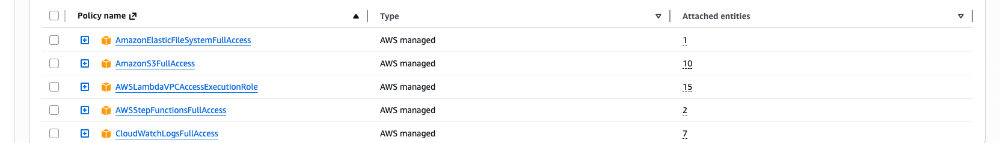

# Rootly

Prerequisites:
https://paiml.com/blog/2024-11-29-hacking-aws-cloudshell-with-rust/

Required IAM roles:


Required VPC Create it with wizard

For Debug use CloudShell with private subnet and nat
```
sudo yum install -y amazon-efs-utils
mkdir ~/efs_mount
sudo mount -t efs -o tls fs-<efs_id>:/ ~/efs_mount
```